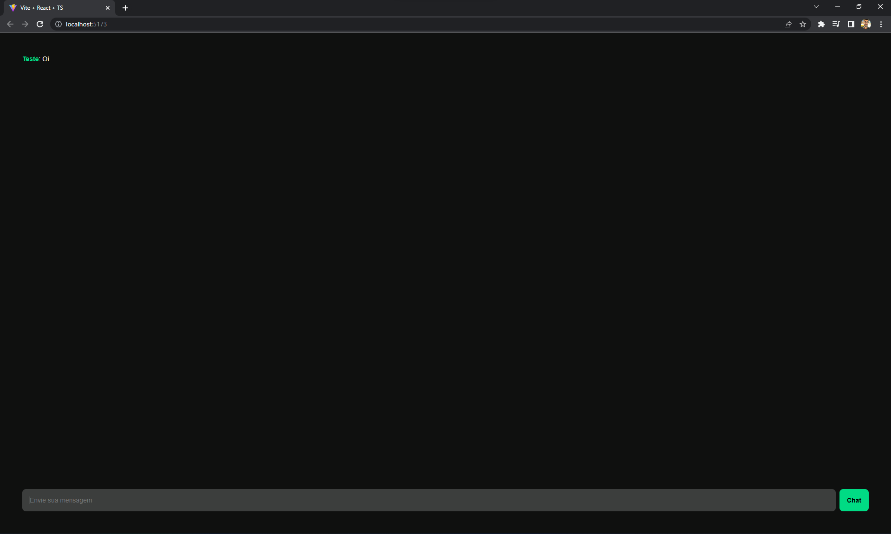

# chat-app

O chat-app é um projeto pessoal para estudar:

- React
- Recoil
- Axios
- StyledComponents
- WebSockets

## Guia

No diretório do projeto, você pode rodar:

### `npm run dev`

Roda o app em modo de desenvolvimento.\
Abra [http://localhost:5173](http://localhost:5173) para ver em seu navegador.

No diretório `/backend`, você pode rodar:

### `node index.js`

Inicia a api da aplicação.

A página irá recarregar se você fizer edições.\
Você também pode ver erros de lint no console.
